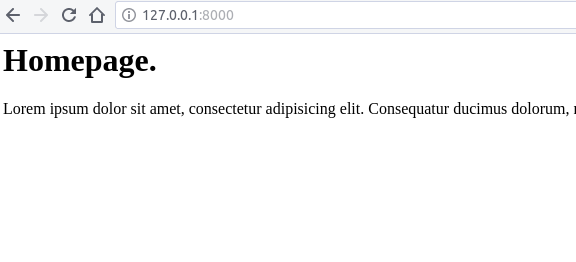
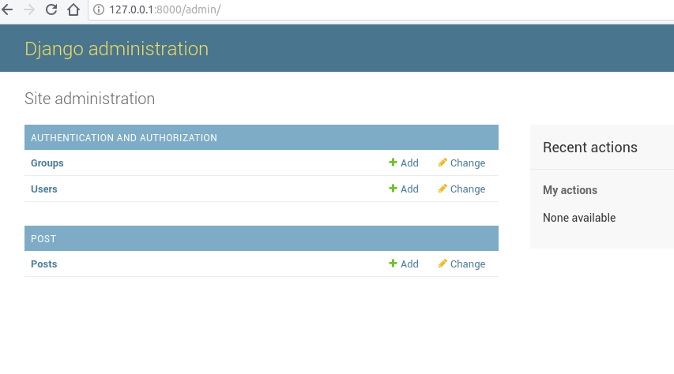

# DJANGO 2.0

* [Introducción](#introducción)
* [Requerimientos previos](#requerimientos-previos)
* [Pipenv](#pipenv)
    * [Instalación de Pipenv](#instalación-de-pipenv)
    * [Uso de Pipenv](#uso-de-pipenv)
* [Creación de un proyecto con Django](#creación-de-un-proyecto-con-django)
* [Hello World!](#hello-world)
* [App con templates](#app-con-templates)
    * [Templates](#templates)
    * [Extendiendo el Template](#extendiendo-el-template)
* [Admin y DB](#admin-y-db)
* [Lista de proyectos](#lista-de-proyectos)

[Guia anterior Django1.11](https://github.com/Deckon/Django1.11)

## Introducción
Esta es una pequeña guia para la creación de proyectos con la ultima version de Django 2.0.X y las herramientas recomendadas para su gestion. Esta guia toma como referencia la excelente documentación creada por el profesor **[Will Vincent](https://wsvincent.com/)** en su pagina [https://djangoforbeginners.com/](https://djangoforbeginners.com/)

## Requerimientos previos
Para poder ejecutar **Django** en nuestro equipo es necesario tener instalado lo siguiente:

* **Python 3:** La ultima version del lenguaje de programación sobre el cual trabaja Django 2.0.X.
* **Pip:** Gestor de paquetes de Python.

## Pipenv
Anteriormente al desarrollar con **Python** era necesario usar las dos principales herramientas de este lenguaje: **Pip** como gestor de paquetes y **virtualenv** como gestor de entornos virtuales, estas eran las herramientas recomendadas por **Python**. Actualemente estas dos herramientas han sido desplazadas por **Pipenv** el cual combina las funcionalidades de ambas.

Por un lado **Pipenv** crea un entorno virtual donde instala, desinstala y actualiza paquetes de manera aislada del sistema u otros entornos virtuales, ademas de crear un par de archivos los cuales gestionan las dependencias de nuestra aplicación permitiendonos transladar estos archivos a otro entorno y reinstalar las dependencias adecuadas para el funcionamiento de la aplicación. 

### Instalación de Pipenv
La forma mas sencilla de instalar **Pipenv** es mediane **Pip**

Comprobar que **Pip** esta instalado:
~~~sh
$ pip3 --version
pip 9.0.1 from /usr/lib/python3/dist-packages (python 3.6)
~~~

En caso de no estar instalado es necesario instalarlo
~~~sh
$ sudo apt install python3-pip
~~~

***Nota:*** *Esta instalacion se realiza en un sistema Linux con base Deb*

Instalacion de **Pipenv**
~~~sh
$ sudo -H pip3 install -U pipenv
~~~

Comprobar que **Pipenv** se instalo correctamente
~~~sh
$ pipenv --version
pipenv, version 9.0.3
~~~

### Uso de Pipenv
**Instalación** de una biblioteca y creación de su entorno virtual usando **Python 3**
~~~sh
# Creación de la carpeta donde se alojara el entorno y los documentos de dependencias
$ mkdir Entorno

# Creacion del entorno virtual e instalación del paquete
$ pipenv --three install django
~~~
Esto crea un archivo **Pipfile** y **Pipfile.lock** los cuales gestionan las dependencias del entorno virtual. 
Los entornos virtuales se alojan en **/home/usuario/.local/share/virtualenvs** el cual tambien genera un enlace sinbolico en **/home/usuario/.virtualenv**.

Instalación de una **version específica** de un paquete
~~~sh
# Instala especificamente la versión 1.10.1 de Django
$ pipenv --three install 'django==1.10.1'
ó
# Instala una version de Django mayor a la 1.10 pero menor a la 1.11
$ pipenv --three install 'django>1.10,<1.11'
~~~

**Activación** del entorno virtual
~~~sh
$ pipenv shell
(django-JmZ1NTQw) $
~~~

**Actualizar** paquetes del entorno virtual
~~~sh
(django-JmZ1NTQw) $ pipenv --update
~~~

Ver las **dependencias** del entorno virtual
~~~sh
(django-JmZ1NTQw) $ pipenv graph
~~~

**Salir** del entorno virtual
~~~sh
(django-JmZ1NTQw) $ exit
$
~~~

**Desinstalar** un entorno virtual
~~~sh
$ pipenv --rm
~~~

**Instalar las dependencias** de un entorno virtual a partir de los archivos **Pipfile** y **Pipfile.lock**
~~~sh
$ pipenv install
~~~

## Creación de un proyecto con Django

~~~sh
# Creación de la carpeta donde se va a alojar el proyecto
$ mkdir Carpeta

# Cambiar al directorio del proyecto
$ cd Carpeta

# Creacion del entorno e instalación de Django con Python3
$ pipenv --three install django

# Activacion del entorno
$ pipenv shell

(django-JmZ1NTQw) $
~~~

Crear el proyecto con **Django**
~~~sh
(django-JmZ1NTQw) $ django-admin.py startproject nuevo .
~~~

Ejecutar el servidor de **Django** para comprobar que todo se instalo y funciona correctamente
~~~sh
# Moverse dentro de la carpeta del proyecto
(django-JmZ1NTQw) $ cd nuevo

# Ejecutar el servidor
(django-JmZ1NTQw) $ ./manage.py runserver
Performing system checks...

System check identified no issues (0 silenced).

You have 14 unapplied migration(s). Your project may not work properly until you apply the migrations for app(s): admin, auth, contenttypes, sessions.
Run 'python manage.py migrate' to apply them.

February 18, 2018 - 01:38:44
Django version 2.0.2, using settings 'nuevo.settings'
Starting development server at http://127.0.0.1:8000/
Quit the server with CONTROL-C.
~~~

Al ingresar la dirección **http://127.0.0.1:8000/** se deberia visualizar algo como lo siguiente:

Para finalizar el servidor se precionan las teclas <kbd>Ctrl</kbd> + <kbd>C</kbd> y para salir del entorno
~~~sh
(django-JmZ1NTQw) $ exit
$
~~~

## Hello World!
~~~sh
# Creación de la carpeta raiz 
$ mkdir helloworld

# Cambiar a la carpeta raiz
$ cd helloworld

# Crear entorno virtual e instalación de Django
$ pipenv --three install django

# Activación del entorno virtual
$ pipenv shell

# Entorno activado
(helloworld-415ivvZC) $

# Iniciar el proyecto
(helloworld-415ivvZC) $ django-admin startproject helloworld_project .

# Ejecutar el servidor para comprobar que Django se ejecuta correctamente
(helloworld-415ivvZC) $ ./manage.py runserver

# Crear una aplicación
(helloworld-415ivvZC) $ ./manage.py startapp pages
~~~

Se añade la aplicación al archivo **settings.py**
~~~python
INSTALLED_APPS = [
    'django.contrib.admin',
    'django.contrib.auth',
    'django.contrib.contenttypes',
    'django.contrib.sessions',
    'django.contrib.messages',
    'django.contrib.staticfiles',
    'pages.apps.PagesConfig',   <- Aplicación añadida pages/apps.py/PagesConfig()
]
~~~

Se crea la vista en el archivo **pages/views.py**
~~~python
from django.shortcuts import render

# Create your views here.
from django.http import HttpResponse

def homePageView(request):
    return HttpResponse('Hola Mundo!')
~~~

Se crear el archivo **pages/urls.py** y se agrega la vista
~~~python
from django.urls import path

from . import views

urlpatterns = [
    path('', views.homePageView, name='home')
]
~~~

Se edita el archivo urls principal **helloworld_project/urls.py**
~~~python
from django.contrib import admin
from django.urls import path, include # Se añade el include

urlpatterns = [
    path('admin/', admin.site.urls),
    path('', include('pages.urls')), # Se añade la ruta a pages/urls.py
]
~~~

Se ejecuta nuevamente el servidor para probar la aplicación
~~~sh
(helloworld-415ivvZC) $ ./manage.py runserver
~~~

Al ingresar la dirección **http://127.0.0.1:8000/** se deberia visualizar algo como lo siguiente:

## App con templates
~~~sh
$ mkdir simple

$ cd simple

$ pipenv --three install django

$ pipenv shell

(simple-BrSeYfS6) $

(simple-BrSeYfS6) $ django-admin startproject simple_project .

(simple-BrSeYfS6) $ ./manage.py startapp pages
~~~

**settings.py**
~~~python
INSTALLED_APPS = [
    'django.contrib.admin',
    'django.contrib.auth',
    'django.contrib.contenttypes',
    'django.contrib.sessions',
    'django.contrib.messages',
    'django.contrib.staticfiles',
    'pages.apps.PagesConfig',
]
~~~

Comprobamos que todo funciona
~~~sh
(simple-BrSeYfS6) $ ./manage.py runserver
~~~

### Templates

~~~sh
(simple-BrSeYfS6) $ mkdir templates
(simple-BrSeYfS6) $ touch templates/home.html
~~~

Esto deja una estrucutura del proyecto como la siguiente:
~~~sh
.
├── db.sqlite3
├── manage.py
├── pages
│   ├── admin.py
│   ├── apps.py
│   ├── __init__.py
│   ├── migrations
│   ├── models.py
│   ├── tests.py
│   └── views.py
├── Pipfile
├── Pipfile.lock
├── simple_project
│   ├── __init__.py
│   ├── __pycache__
│   ├── settings.py
│   ├── urls.py
│   └── wsgi.py
└── templates       <-- Directorio templates
    └── home.html
~~~

Añadir el **template** en **settings.py**
~~~python
TEMPLATES = [
    {
        'BACKEND': 'django.template.backends.django.DjangoTemplates',
        'DIRS': [os.path.join(BASE_DIR, 'templates')],  <- Añadiendo la carpeta templates al proyecto
        'APP_DIRS': True,
        'OPTIONS': {
            'context_processors': [
                'django.template.context_processors.debug',
                'django.template.context_processors.request',
                'django.contrib.auth.context_processors.auth',
                'django.contrib.messages.context_processors.messages',
            ],
        },
    },
]
~~~

Se añade algo de texto al **template** creado **templates/home.html**
~~~html
<h1>Homepage.</h1>

Lorem ipsum dolor sit amet, consectetur adipisicing elit. Consequatur ducimus dolorum, recusandae enim, quidem facere?

~~~

En versiones anteriores de **Django** se usaban las **vistas** creadas mediante **funciones** , para cumplir la filosofia DRY (Don't Repeat Yourself) se introdujo las **Class-Based Views**, vistas creadas con **clases**

Se crea la **vista** en **pages/views.py**
~~~python
from django.views.generic import TemplateView

class HomePageView(TemplateView):
    template_name = 'home.html'
~~~

Se crea la **url** para la vista creando el archivo **pages/urls.py**

~~~sh
(simple-BrSeYfS6) $ touch pages/urls.py
~~~

**pages/urls.py**
~~~python
from django.urls import path

from . import views

urlpatterns = [
    path('', views.HomePageView.as_view(), name='home'),
]
~~~

Se añade la **url** del archvio **pages/urls.py** en **simple_project/urls.py**
~~~python
from django.contrib import admin
from django.urls import path, include # Se añade el include

urlpatterns = [
    path('admin/', admin.site.urls),
    path('', include('pages.urls')), # URL de pages/url.py
]
~~~

Se prueba que la vista este funcionando correctamente
~~~sh
(simple-BrSeYfS6) $ ./manage.py runserver
~~~

Al ingresar la dirección **http://127.0.0.1:8000/** se deberia visualizar algo como lo siguiente:

Se añade una pagina About siguiendo los pasos anteriores
~~~sh
(simple-BrSeYfS6) $ touch templates/about.html
~~~

Se añade texto al **about.html**
~~~html
<h1>About page.</h1>

Lorem ipsum dolor sit amet, consectetur adipisicing elit. Consequatur ducimus dolorum, recusandae enim, quidem facere?

~~~

Se añade la vista en **pages/views.py**
~~~python
from django.views.generic import TemplateView

# Vista de Home
class HomePageView(TemplateView):
    template_name = 'home.html'

# Vista de About
class AboutPageView(TemplateView):
    template_name = 'about.html'
~~~

Se añade la **URL** del about en **pages/urls.py**
~~~python
from django.urls import path

from . import views

urlpatterns = [
    path('', views.HomePageView.as_view(), name='home'),
    path('about/', views.AboutPageView.as_view(), name='about'), # Se añade la URL del about
]
~~~

### Extendiendo el Template
Se crea un archivo **base.html**
~~~sh
(simple-BrSeYfS6) $ touch templates/base.html
~~~

Se le añade contenido a **templates/base.html**
~~~html
<!-- pages/base.html -->
<header>
  <a href="">Home</a> | <a href="">About</a>
</header>



~~~

Se extiende el contenido de **base.html** en **home.html** y en **about.html**
**templates/home.html**
~~~html
<!-- templates/home.html -->



<h1>Homepage.</h1>

Lorem ipsum dolor sit amet, consectetur adipisicing elit. Consequatur ducimus dolorum, recusandae enim, quidem facere?


~~~

**templates/about.html**
~~~html
<!-- templates/about.html -->



<h1>About page.</h1>

Lorem ipsum dolor sit amet, consectetur adipisicing elit. Consequatur ducimus dolorum, recusandae enim, quidem facere?


~~~

Generando un resultado parecido a esto:

## Admin y DB
En esta seccion se creara un proyecto de Django que usa Bases de Datos y la interfaz administrativa de Django.
La Base de Datos que se usara es la BD por defecto de Django **SQLite**
~~~sh
$ mkdir mb

$ cd mb

$ pipenv --three install django

$ pipenv shell

(mb-oo2dIS7L) $

(mb-oo2dIS7L) $ django-admin startproject mb_project .

(mb-oo2dIS7L) $ ./manage.py startapp posts
~~~

**settings.py**
~~~python
INSTALLED_APPS = [
    'django.contrib.admin',
    'django.contrib.auth',
    'django.contrib.contenttypes',
    'django.contrib.sessions',
    'django.contrib.messages',
    'django.contrib.staticfiles',
    'post.apps.PostConfig',
]
~~~

Para establecer el idioma y la zona horaria se realizan las modificaciones necesarias en el **settings.py**
~~~python
LANGUAGE_CODE = 'es-mx'

TIME_ZONE = 'America/Mexico_City'
~~~

Se realiza la migracion de la BD
~~~sh
(mb-oo2dIS7L) $ ./manage.py migrate

Operations to perform:
  Apply all migrations: admin, auth, contenttypes, sessions
Running migrations:
  Applying contenttypes.0001_initial... OK
  Applying auth.0001_initial... OK
  Applying admin.0001_initial... OK
  Applying admin.0002_logentry_remove_auto_add... OK
  Applying contenttypes.0002_remove_content_type_name... OK
  Applying auth.0002_alter_permission_name_max_length... OK
  Applying auth.0003_alter_user_email_max_length... OK
  Applying auth.0004_alter_user_username_opts... OK
  Applying auth.0005_alter_user_last_login_null... OK
  Applying auth.0006_require_contenttypes_0002... OK
  Applying auth.0007_alter_validators_add_error_messages... OK
  Applying auth.0008_alter_user_username_max_length... OK
  Applying auth.0009_alter_user_last_name_max_length... OK
  Applying sessions.0001_initial... OK
~~~
Esta operacion genera el contenido en la BD en el archivo **db.sqlite3** que se genera en el proyecto.

**post/models.py**
~~~python
from django.db import models

# Create your models here.
class Post(models.Model):
    text = models.TextField()   # Nombre del campo y tipo de dato
~~~
En este caso se indica que se cree en la BD un campo de nombre **text** de tipo **TextField**.

Ya que se creo un nuevo modelo con un nuevo campo es necesario crear la migracion de datos a la BD
~~~sh
(mb-oo2dIS7L) $ ./manage.py makemigrations post

Migrations for 'post':
  post/migrations/0001_initial.py
    - Create model Post
~~~
~~~sh
(mb-oo2dIS7L) $ ./manage.py migrate

Operations to perform:
  Apply all migrations: post
Running migrations:
  Applying post.0001_initial... OK
~~~

Se crea un Super Usuario para usar el admin de Django
~~~sh
(mb-oo2dIS7L) $ ./manage.py createsuperuser

Username (leave blank to use 'usuario'):
Email:
Password:
Password (again):
Superuser created successfully.
~~~

Se ejecuta el servidor
~~~sh
(mb-oo2dIS7L) $ ./manage.py runserver
~~~
Al ingresar a la direccion **http://127.0.0.1:8000/admin/** nos aparece la pantalla de login del administrador

Despues de ingresar el usuario y contraseña del super usuario que se creo, se muestra una pantalla como la siguiente

Para mostrar el campo del modelo se edita **post/admin.py**
~~~python
from django.contrib import admin
from .models import Post

# Register your models here.

admin.site.register(Post)
~~~

y se añade una funcion a **post/models.py** para mostrar el contenido de los campos
~~~python
from django.db import models

# Create your models here.
class Post(models.Model):
    text = models.TextField()   # Nombre del campo y tipo de dato

    def __str__(self):  # Función añadida para que muestre correctamente los campos del modelo
        return self.text
~~~

**post/views.py**
~~~python
posts/views.py
~~~

Se crean los templates
~~~sh
(mb-oo2dIS7L) $ mkdir templates

(mb-oo2dIS7L) $ touch templates/home.html
~~~

**settings.py**
~~~python
TEMPLATES = [
    {
        'BACKEND': 'django.template.backends.django.DjangoTemplates',
        'DIRS': [os.path.join(BASE_DIR, 'templates')],
        'APP_DIRS': True,
        'OPTIONS': {
            'context_processors': [
                'django.template.context_processors.debug',
                'django.template.context_processors.request',
                'django.contrib.auth.context_processors.auth',
                'django.contrib.messages.context_processors.messages',
            ],
        },
    },
]
~~~

**templates/home.html**
~~~html
<h1>Message board homepage</h1>
<ul>
  
    <li>{{ post }}</li>
  
</ul>
~~~

**mb_project/urls.py**
~~~python
from django.contrib import admin
from django.urls import path, include

urlpatterns = [
    path('admin/', admin.site.urls),
    path('', include('posts.urls')),
]
~~~

Se crea el archvi **post/urls.py**
~~~sh
(mb-oo2dIS7L) $ touch templates/urls.html
~~~

**post/urls.py**
~~~python
from django.urls import path

from . import views

urlpatterns = [
    path('', views.HomePageView.as_view(), name='home'),
]
~~~

Se ejecuta el servidor
~~~sh
(mb-oo2dIS7L) $ ./manage.py runserver
~~~

Al ingresar la dirección **http://127.0.0.1:8000/** se deberia visualizar algo como lo siguiente:

Desde el admin se puede seguir añadiendo contenido

## Lista de proyectos
En esta seccion se pondran los enlaces de git de cada uno de los proyectos realizados: